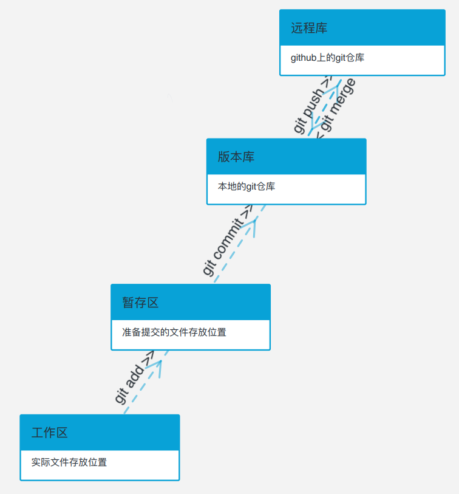

> 简单工作索引：

### 0、git工作区、暂存区、版本库、远程库

+ **工作区**：电脑中实际的文件目录。

+ **暂存区**：存放于<kbd>.git/index</kbd>中的一个文件目录树。

+ **版本库**：存放于<kbd>.git</kbd>中的文件，包括：暂存区目录树、各分支的目录树、**对象库**（object）。

  >对象库中存放了各个目录树实际创建的所有内容

+ **远程库**：托管在github上的一个分支副本。

  结构大致如图：

  

  

### 1、git建立仓库并上传分支

git init:在当前目录创建一个git仓库；

git remote add origin <url_>:链接一个远程仓库,命名为origin；

git clone <url_>：克隆远端库到当前目录，本地库与远端库同名（可在末尾指定新的目录名称）；

git add . /git add <file_name>：把(全部)文件加入暂存区；

git commit -m “commit_information”：以该上传标题上传至当前branch（本地库）；

git push：将当前分支推送到远程库；

git pull origin master:从origin的master分支上拉取一个版本和本地分支合并；

### 2、git分支处理

git switch -c <branch_name>：新建一个branch并转到该branch；

git switch <branch_name>：转到一个已有的branch；

git merge <branch_name>：把该分支合并到当前分支；

git branch -d <branch_name>：删除该分支；

### 3、git删除文件

git rm <file_name>：将文件从暂存区和工作区删除；

git rm -f  <file_name>：强制将文件从暂存区和工作区删除；

git rm --cached <file_name>：将文件从暂存区删除；

git rm -r *：删除当前目录下的所有文件/子目录；

### 4、git回退版本

git reset HEAD <file_name>：将文件从暂存区删除；

> （可不带文件名）

git reset HEAD^：回退到上一个版本；

> （HEAD^为上一个版本，HEAD^^为上上个版本，以此类推）

git reset HEAD^  <file_name>：将该文件回退到上一个版本；

### 5、git查看历史记录

git log：显示提交历史；

git log --oneline：显示提交历史的简介版本；

###  -1、其他

git status：显示目前git工作状态（加-s参数显示简要信息）；

> -s参数说明：
>
> `?` 标记： 新添加的未跟踪文件 ；
>
> `A` 标记：新添加到暂存区中的文件；
>
> 左`M`标记：修改过且<u>被放入缓存区</u>的文件；
>
> 右`M`标记：修改过且<u>未被放入缓存区</u>的文件；
>
> 输出标记会有两列,第一列是对staging区域而言,第二列是对working目录而言；

git push失败：

+ （windows） 打开cmd 运行命令：ipconfig/flushdns——>清除dns缓存。